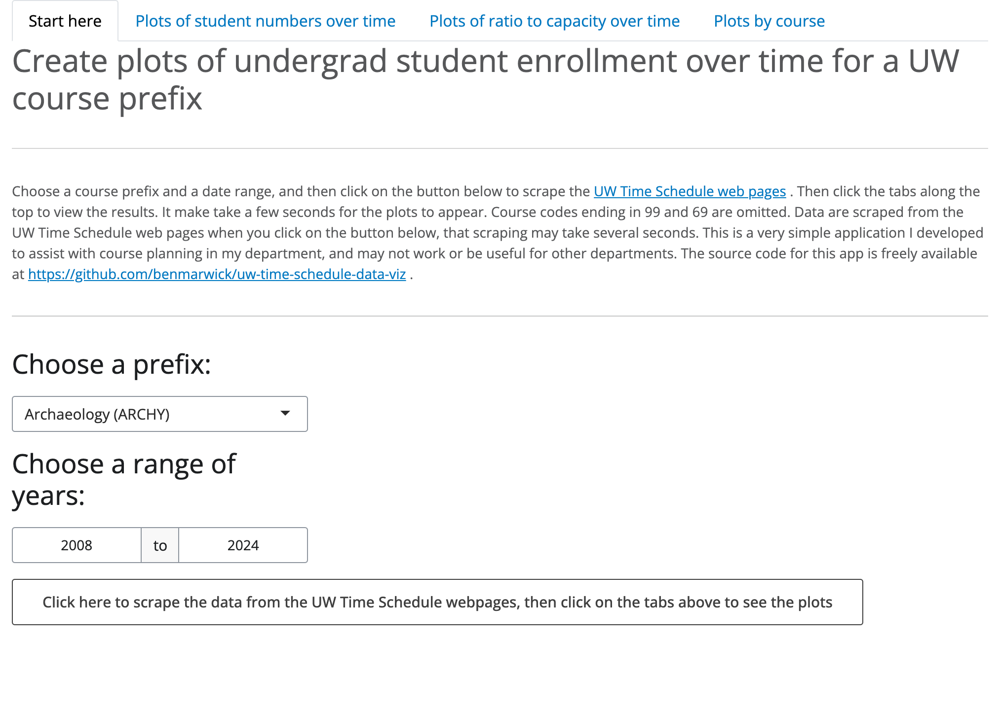
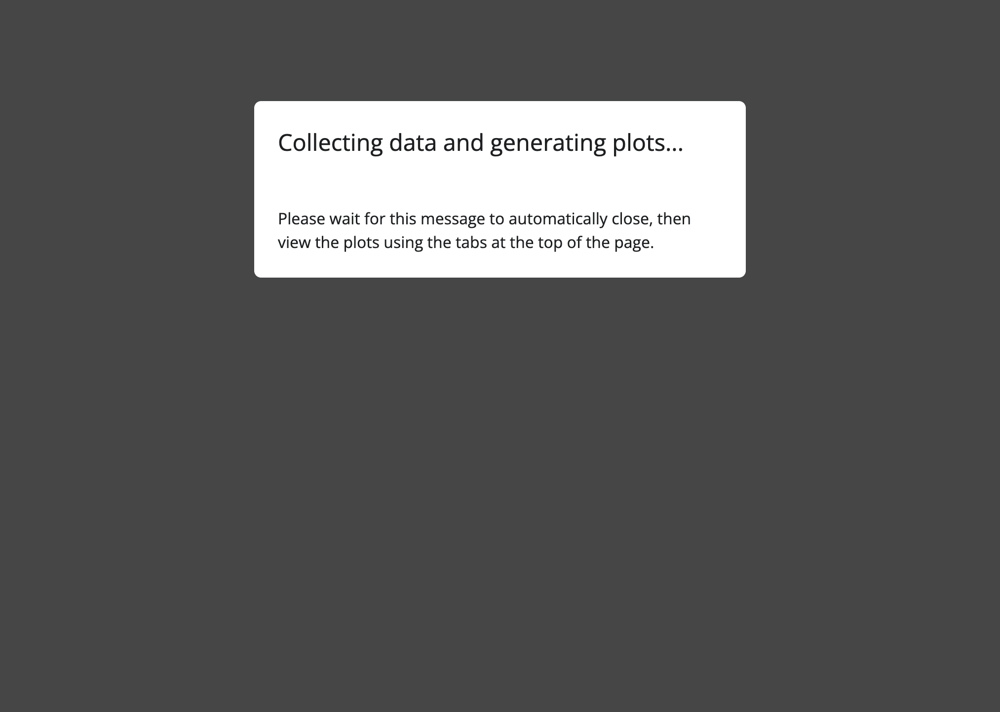
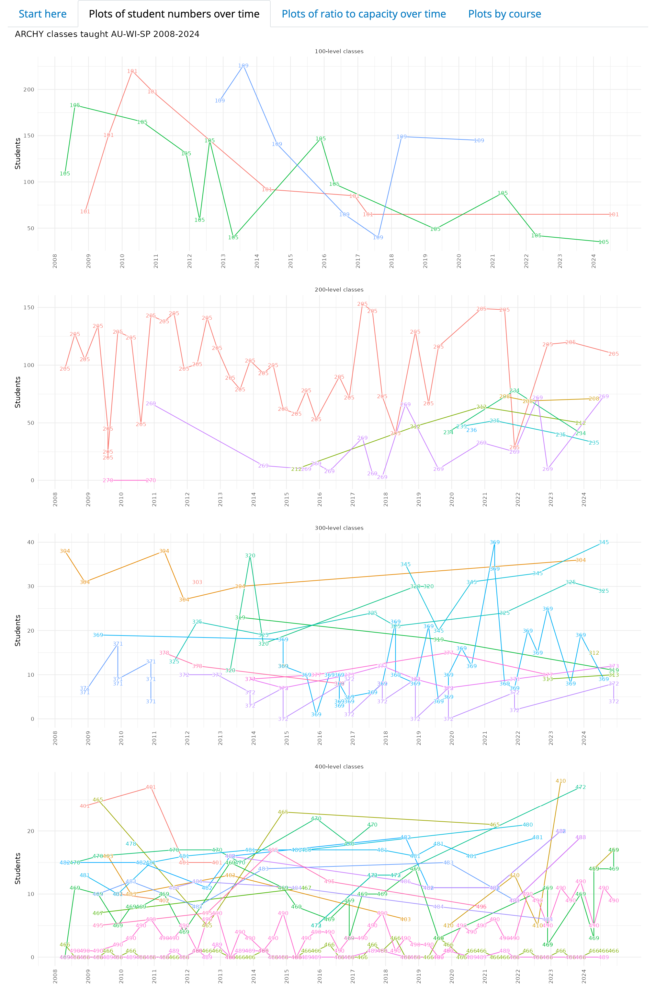
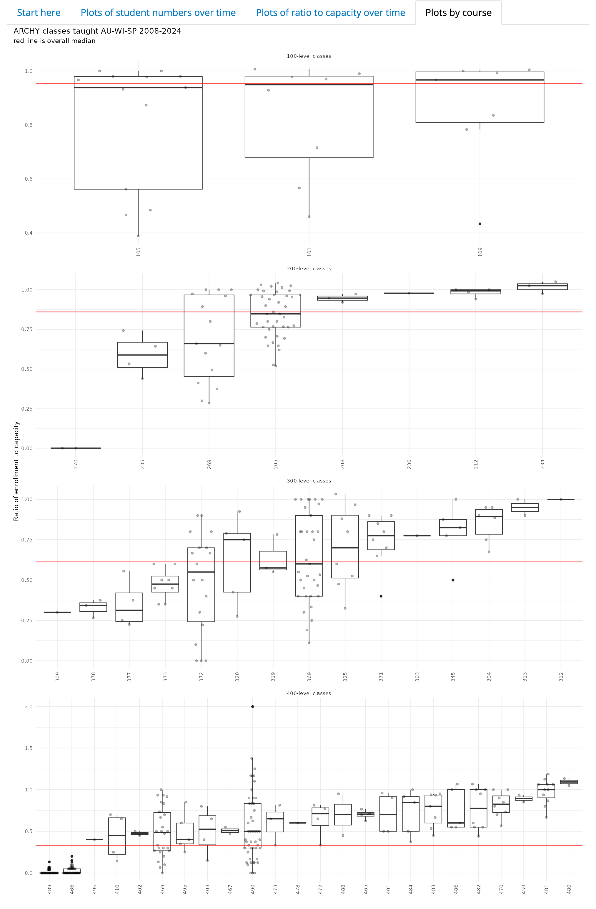

# UW Time Schedule Data Viz

The goal of this project is to get insights on historical trends of undergraduate class sizes for a given prefix (e.g. ARCHY) at UW.

The data are collected on the fly from <https://www.washington.edu/students/timeschd/> These UW Time Schedule web pages are public information, no log in is required. The structure of those web pages makes class enrollment data very awkward to work with for faculty and staff looking for insights to help with course planning. This application automates data collection to make it easier to examine trends and patterns to help make informed decisions about course planning.

The application can be run in the browser by going to <https://ben-marwick.shinyapps.io/uwtimescheduleViz/> (no download required).

Here are some screenshots showing it at work:

